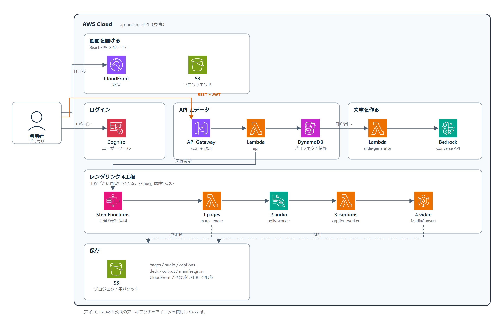
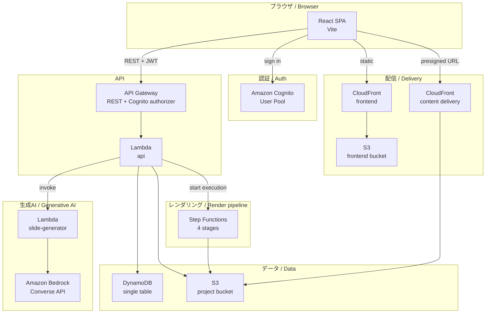
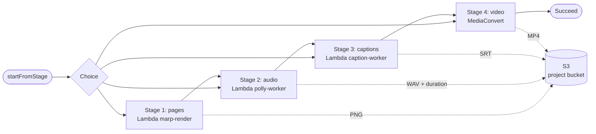
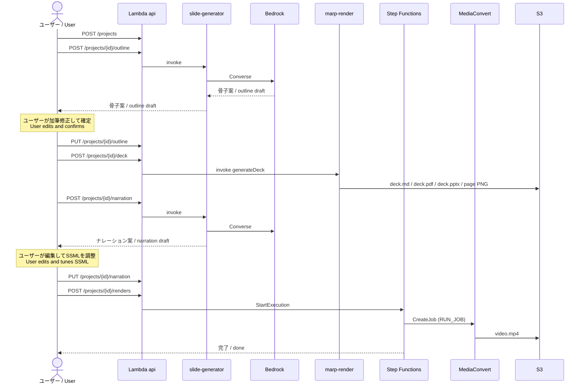
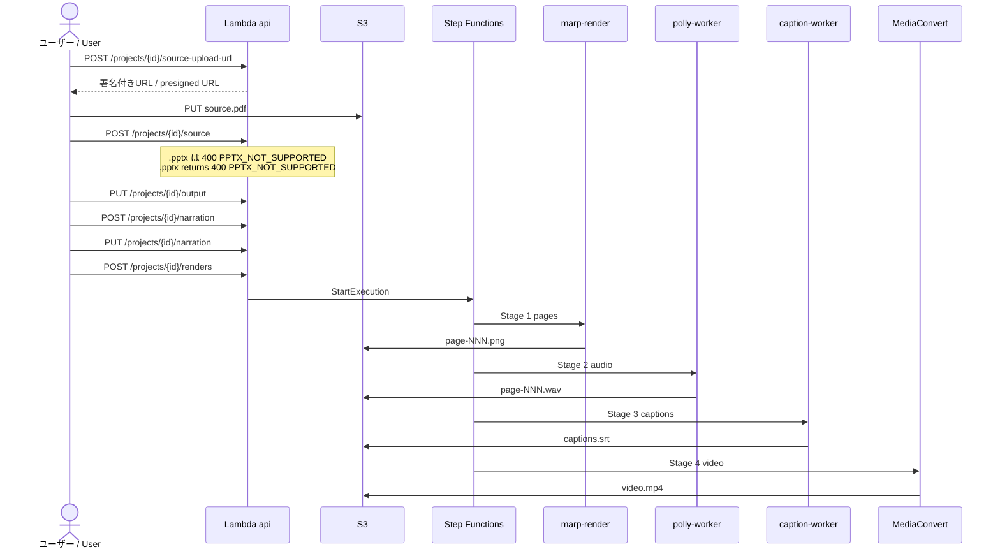
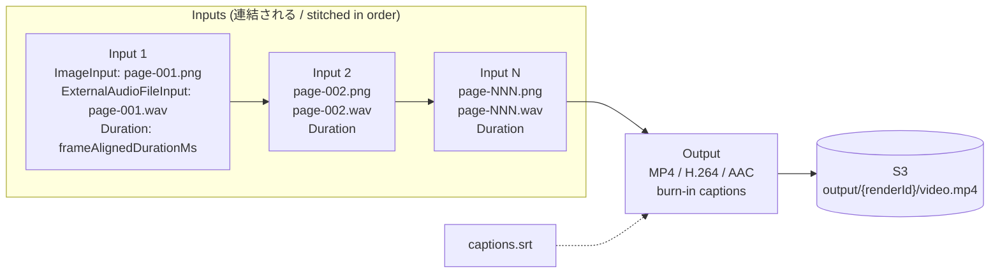

# アーキテクチャ / Architecture

このファイルは図を中心にしたアーキテクチャ資料です。サービス名と工程名は英語のままにして、日本語と英語のどちらから読んでも同じ図を参照できるようにしています。

This file collects the architecture diagrams. Service and stage names are kept in English so that the same diagrams serve both language sections of the README.

---

## 0. 構成図 / Architecture diagram

AWS公式のアーキテクチャアイコンを使った構成図です。ベクター形式は [assets/architecture.svg](./assets/architecture.svg) にあります。

The following diagram uses the official AWS architecture icons. A vector version is available at [assets/architecture.svg](./assets/architecture.svg).



この図は `assets/build-architecture-svg.mjs` で生成しています。アイコン本体はリポジトリに含めていないため、再生成するにはAWS公式のアイコンパッケージから `assets/aws-icons/` へSVGを配置してください。

The diagram is generated by `assets/build-architecture-svg.mjs`. The icons themselves are not committed, so to regenerate it, place the SVGs from the official AWS icon package into `assets/aws-icons/`.

---

## 1. システム全体 / System overview



---

## 2. レンダリングパイプライン / Render pipeline

4工程です。各工程は単独で再実行できます。FFmpegは使いません。

Four stages. Each stage can be retried on its own. No FFmpeg is involved.



| 工程 / Stage | 実装 / Implementation | 出力 / Output | 使う技術 / Technology |
| --- | --- | --- | --- |
| 1 pages | `marp-render` | `pages/page-NNN.png` | Chromium + pdf.js（アップロードされたPDF） / Marp（生成したデッキ） |
| 2 audio | `polly-worker` | `audio/page-NNN.wav` | Amazon Polly（PCM出力） |
| 3 captions | `caption-worker` | `captions/captions.srt` | 純粋なJavaScript / Pure JavaScript |
| 4 video | Step Functions → MediaConvert | `output/{renderId}/video.mp4` | AWS Elemental MediaConvert |

---

## 3. フロー A: スライド生成から動画まで / Flow A: from slide generation to video



---

## 4. フロー B: PDFアップロードから動画まで / Flow B: from PDF upload to video

スライド生成を経由しません。他のツールで作った資料をそのまま動画化できます。

This path does not involve slide generation. A deck made in another tool can be turned into video directly.



---

## 5. MediaConvertのジョブ構造 / MediaConvert job structure

ページごとに1入力を作り、順番に連結します。1ジョブで最大150入力です。

One input per page, stitched in order. Up to 150 inputs per job.



表示時間はフレーム境界に丸めます。MediaConvertが入力ごとに切り上げるため、先に揃えておかないと合計がずれます。

Durations are aligned to frame boundaries. MediaConvert rounds each input up to whole frames, so aligning first keeps the total exact.

```text
frameMs    = 1000 × framerateDenominator / framerateNumerator   （30fps なら 33.3333）
frames     = ceil(audioDurationSec × 1000 / frameMs)
durationMs = round(frames × frameMs)
```

---

## 6. S3のレイアウト / S3 layout

```text
s3://<project bucket>/users/{userId}/projects/{projectId}/
├─ input/source.pdf              アップロードされた資料 / uploaded deck
├─ deck/
│  ├─ deck.md                    Marp原稿 / Marp source
│  ├─ deck.pdf                   動画生成に使う / used by the pipeline
│  └─ deck.pptx                  ダウンロード用（各ページは画像） / download only (pages as images)
├─ pages/page-001.png ...        ページ画像 / page images
├─ audio/page-001.wav ...        ナレーション音声 / narration audio
├─ captions/captions.srt         字幕 / captions
├─ output/{renderId}/video.mp4   完成した動画 / finished video
└─ manifest.json                 この資料の唯一の正本 / the single source of truth
```

---

## 7. 設計上の制約 / Design constraints

| 制約 / Constraint | 理由 / Reason |
| --- | --- |
| Dockerを使わない / No Docker | 開発機がBoot Camp上のWindows 10で、Dockerを導入できない / The development machine runs Windows 10 under Boot Camp and cannot install Docker |
| FFmpeg・ffprobeを使わない / No FFmpeg or ffprobe | `nodejs22.x` ランタイムに存在せず、コンテナも使えないため / Not present in the `nodejs22.x` runtime, and container images are not an option |
| pdftoppmを使わない / No pdftoppm | Chromium内のpdf.jsで代替する / Replaced by pdf.js running inside Chromium |
| LibreOfficeを使わない / No LibreOffice | PPTXのアップロードは非対応とし、PDFでの書き出しを案内する / PPTX upload is not supported; users export to PDF instead |
| 音声の長さを実測する / Measure audio length | PollyのPCM出力のバイト数から厳密に算出する。推定値は使わない / Computed exactly from the byte count of Polly PCM output, never estimated |

詳細と検証済みの実測値は `設計指示書_動画生成パイプライン.md` にあります。

Details and the verified measurements are in `設計指示書_動画生成パイプライン.md`.
