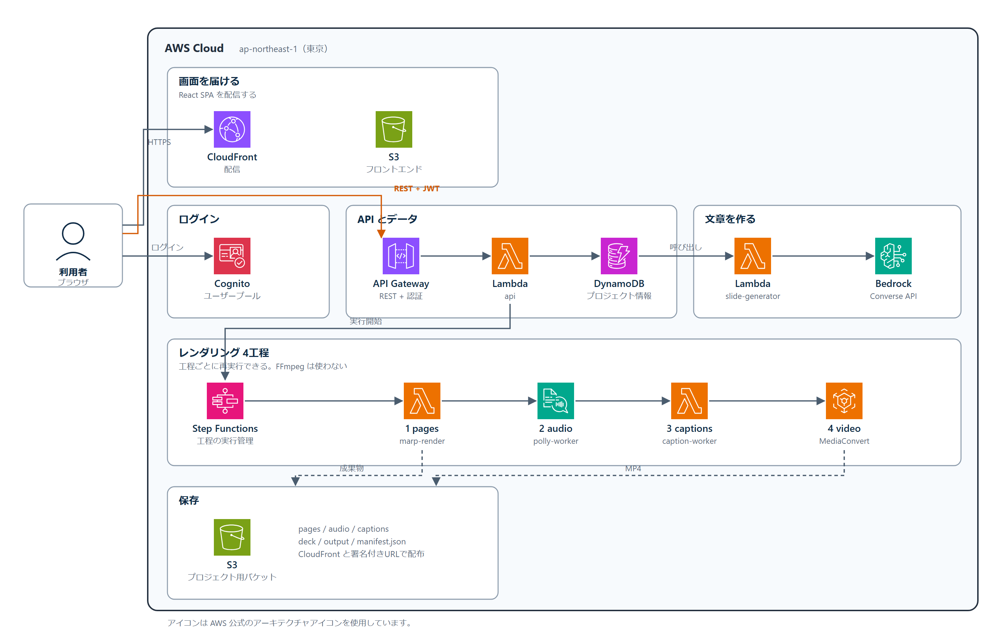
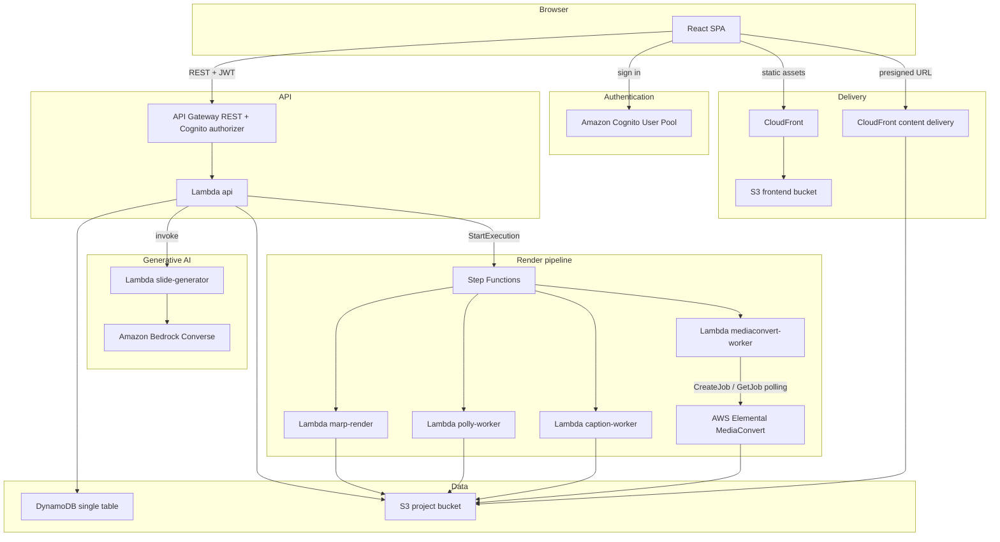
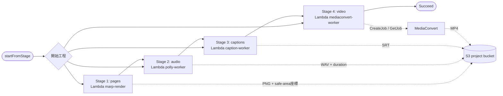
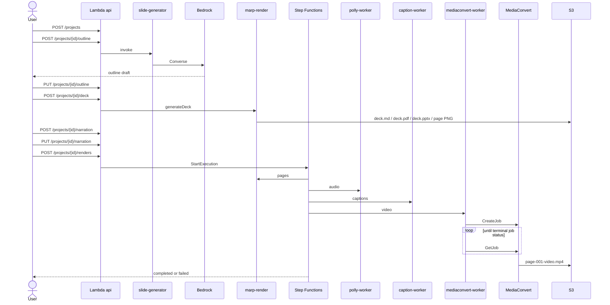
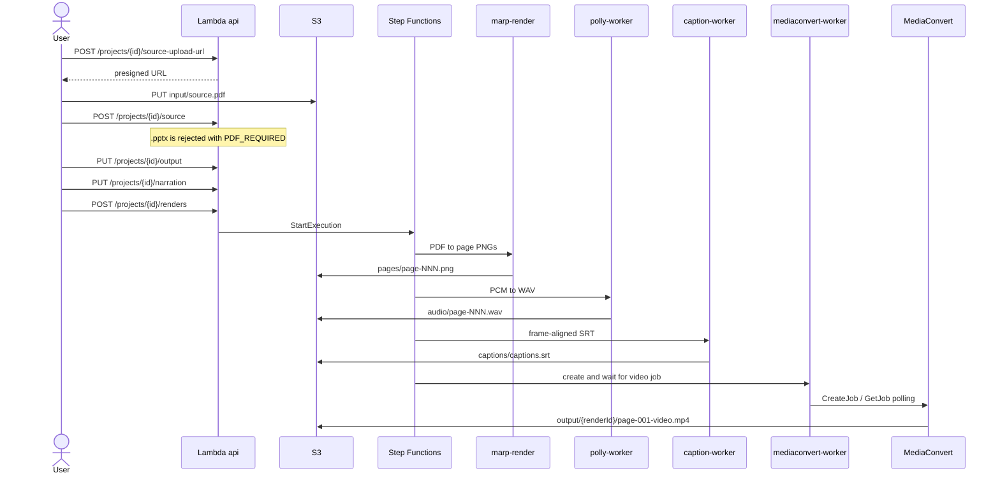

# アーキテクチャ / Architecture

この文書は現行の4工程動画生成パイプラインを説明します。構成図の画像は概念図であり、LambdaとMediaConvertの正確な実行順序はこの文書のMermaid図を正本とします。

This document describes the current four-stage video pipeline. The image is conceptual; the Mermaid diagrams below are authoritative for the Lambda and MediaConvert execution flow.

---

## 1. システム全体 / System overview



ベクター形式は[assets/architecture.svg](./assets/architecture.svg)にあります。画像を再生成するスクリプトは`assets/build-architecture-svg.mjs`です。


```mermaid
flowchart TB
    subgraph Client[Browser]
        UI[React SPA]
    end

    subgraph Delivery[Delivery]
        CFF[CloudFront]
        S3F[S3 frontend bucket]
        CFC[CloudFront content delivery]
    end

    subgraph Auth[Authentication]
        COG[Amazon Cognito User Pool]
    end

    subgraph API[API]
        APIGW[API Gateway REST + Cognito authorizer]
        APILAMBDA[Lambda api]
    end

    subgraph Data[Data]
        DDB[DynamoDB single table]
        S3P[S3 project bucket]
    end

    subgraph AI[Generative AI]
        SG[Lambda slide-generator]
        BR[Amazon Bedrock Converse]
    end

    subgraph Pipeline[Render pipeline]
        SFN[Step Functions]
        MR[Lambda marp-render]
        PW[Lambda polly-worker]
        CW[Lambda caption-worker]
        MW[Lambda mediaconvert-worker]
        MC[AWS Elemental MediaConvert]
    end

    UI -->|static assets| CFF --> S3F
    UI -->|sign in| COG
    UI -->|REST + JWT| APIGW --> APILAMBDA
    APILAMBDA --> DDB
    APILAMBDA --> S3P
    APILAMBDA -->|invoke| SG --> BR
    APILAMBDA -->|StartExecution| SFN
    SFN --> MR
    SFN --> PW
    SFN --> CW
    SFN --> MW
    MR --> S3P
    PW --> S3P
    CW --> S3P
    MW -->|CreateJob / GetJob polling| MC
    MC --> S3P
    UI -->|presigned URL| CFC --> S3P
```

---

## 2. レンダリングパイプライン / Render pipeline

工程は`pages → audio → captions → video`の4つです。`startFromStage`による部分再実行は、S3上の既存manifestが現在の入力・出力設定と互換で、必要な先行工程が完了している場合だけ実行できます。字幕設定追加前の旧manifestで`captionStyle`と`captionPlacement`が未指定の場合は、比較時だけ従来の`white-outline`と`bottom`として扱います。条件を満たさない、または既存manifestが欠損・空・不正な場合はHTTP 409の`PARTIAL_RENDER_REQUIRES_PAGES`を返し、UIは`pages`からの再実行を案内します。S3のIAMアクセス障害はHTTP 500の`MANIFEST_READ_ACCESS_DENIED`、一時的な読取障害はHTTP 503の`MANIFEST_READ_UNAVAILABLE`として区別し、全工程の再実行を誤って案内しません。FFmpeg、ffprobe、Dockerは使いません。


```mermaid
flowchart LR
    START([startFromStage]) --> C{開始工程}
    C --> P[Stage 1: pages\nLambda marp-render]
    C --> A[Stage 2: audio\nLambda polly-worker]
    C --> CAP[Stage 3: captions\nLambda caption-worker]
    C --> V[Stage 4: video\nLambda mediaconvert-worker]

    P --> A --> CAP --> V --> DONE([Succeed])
    P -.->|PNG + safe-area座標| S3[(S3 project bucket)]
    A -.->|WAV + duration| S3
    CAP -.->|SRT| S3
    V -.->|CreateJob / GetJob| MC[MediaConvert]
    MC -.->|MP4| S3
```

| 工程       | 実装                  | 入力                                       | 出力                                                          |
| ---------- | --------------------- | ------------------------------------------ | ------------------------------------------------------------- |
| 1 pages    | `marp-render`         | PDFまたは`deck/deck.pdf`、出力プロファイル | `pages/page-NNN.png`、必要に応じて`captionSafeAreaYPosition`  |
| 2 audio    | `polly-worker`        | 確定原稿、音声設定                         | `audio/page-NNN.wav`、PCMバイト数から求めた`audioDurationSec` |
| 3 captions | `caption-worker`      | 原稿、`frameAlignedDurationMs`             | `captions/captions.srt`                                       |
| 4 video    | `mediaconvert-worker` | PNG、WAV、SRT、出力プロファイル            | `output/{renderId}/page-001-video.mp4`                        |

第4工程はStep FunctionsがMediaConvertへ直接`RUN_JOB`統合する方式ではありません。`mediaconvert-worker`がMediaConvertの`CreateJob`を実行し、`GetJob`をポーリングして`COMPLETE`または失敗状態を確認します。ワーカーは終端状態を工程結果として返し、Step Functionsは失敗を`SUCCEEDED`のまま通しません。

---

## 3. 代表的な実行フロー / Execution flow

### 3.1 ② スライド生成から動画まで


```mermaid
sequenceDiagram
    actor U as User
    participant API as Lambda api
    participant SG as slide-generator
    participant BR as Bedrock
    participant MR as marp-render
    participant SFN as Step Functions
    participant PW as polly-worker
    participant CW as caption-worker
    participant MW as mediaconvert-worker
    participant MC as MediaConvert
    participant S3 as S3

    U->>API: POST /projects
    U->>API: POST /projects/{id}/outline
    API->>SG: invoke
    SG->>BR: Converse
    BR-->>U: outline draft
    U->>API: PUT /projects/{id}/outline
    U->>API: POST /projects/{id}/deck
    API->>MR: generateDeck
    MR->>S3: deck.md / deck.pdf / deck.pptx / page PNG
    U->>API: POST /projects/{id}/narration
    U->>API: PUT /projects/{id}/narration
    U->>API: POST /projects/{id}/renders
    API->>SFN: StartExecution
    SFN->>MR: pages
    SFN->>PW: audio
    SFN->>CW: captions
    SFN->>MW: video
    MW->>MC: CreateJob
    loop until terminal job status
        MW->>MC: GetJob
    end
    MC->>S3: page-001-video.mp4
    SFN-->>U: completed or failed
```

### 3.2 ③ PDFアップロードから動画まで


```mermaid
sequenceDiagram
    actor U as User
    participant API as Lambda api
    participant S3 as S3
    participant SFN as Step Functions
    participant MR as marp-render
    participant PW as polly-worker
    participant CW as caption-worker
    participant MW as mediaconvert-worker
    participant MC as MediaConvert

    U->>API: POST /projects/{id}/source-upload-url
    API-->>U: presigned URL
    U->>S3: PUT input/source.pdf
    U->>API: POST /projects/{id}/source
    Note over API: .pptx is rejected with PDF_REQUIRED
    U->>API: PUT /projects/{id}/output
    U->>API: PUT /projects/{id}/narration
    U->>API: POST /projects/{id}/renders
    API->>SFN: StartExecution
    SFN->>MR: PDF to page PNGs
    MR->>S3: pages/page-NNN.png
    SFN->>PW: PCM to WAV
    PW->>S3: audio/page-NNN.wav
    SFN->>CW: frame-aligned SRT
    CW->>S3: captions/captions.srt
    SFN->>MW: create and wait for video job
    MW->>MC: CreateJob / GetJob polling
    MC->>S3: output/{renderId}/page-001-video.mp4
```

---

## 4. 縦長レイアウトと字幕safe-area / Vertical layout and caption safe area

`9:16`と`4:5`では、工程1がPDFページを固定キャンバスへ描画します。

| `verticalLayout` | 描画方法                                                                                                   |
| ---------------- | ---------------------------------------------------------------------------------------------------------- |
| `top`            | containで縮小し、上端へ寄せます。焼き込み字幕の`safe-area`が選ばれている場合は、下部に字幕帯を確保します。 |
| `center`         | containで縮小し、縦横の余白を中央へ配置します。                                                            |
| `crop`           | coverで拡大して中央をクロップします。                                                                      |

`padColor`は`white`、`navy`、`auto`のいずれかです。`auto`はソース画像の先頭ピクセルを背景色に使います。

safe-areaはクライアントが座標を指定する機能ではありません。`marp-render`が各PNGの実際のコンテンツ下端を測り、字幕帯として十分な下部余白があるときだけ`manifest.output.captionSafeAreaYPosition`を確定します。MediaConvertワーカーは、その有効な座標だけを`BurninDestinationSettings.YPosition`へ渡します。座標がない場合はMediaConvertの通常の下端配置です。

焼き込み字幕のスタイルは以下の固定プリセットです。

| `captionStyle`     | 表現                                                             |
| ------------------ | ---------------------------------------------------------------- |
| `white-outline`    | 白文字、黒アウトラインと影                                       |
| `yellow-outline`   | 黄文字、黒アウトラインと影                                       |
| `black-background` | 白文字、黒背景                                                   |
| `chalkboard`       | 白文字、アウトラインなし。safe-areaのPNG背景を濃緑に描画します。 |

`chalkboard`は`captions: "burn"`、縦型、`verticalLayout: "top"`、`captionPlacement: "safe-area"`がそろうときだけ有効です。

---

## 5. MediaConvertジョブ構造 / MediaConvert job structure

1ページにつき静止画と外部WAVを持つ入力を1件作成し、MediaConvertが入力順に連結します。1ジョブの上限は150入力です。

```mermaid
flowchart LR
    subgraph Inputs[Inputs stitched in order]
        I1[Input 1\npage-001.png + page-001.wav\nDuration: frameAlignedDurationMs]
        I2[Input 2\npage-002.png + page-002.wav]
        IN[Input N\npage-NNN.png + page-NNN.wav]
    end
    SRT[captions/captions.srt] -. burn only .-> I1
    I1 --> I2 --> IN --> OUT[MP4 / H.264 / AAC]
    OUT --> S3[(output/{renderId}/page-001-video.mp4)]
```

- 各入力の`VideoGenerator.Duration`は`frameAlignedDurationMs`です。
- `captions: "burn"`では、SRT Caption Selectorを最初の入力へ設定し、出力に`BURN_IN` Caption Descriptionを設定します。
- MP4はH.264 QVBR、AAC 48kHzで出力します。
- 出力名は最初の入力画像のベース名に`-video`を付けたものです。

フレーム丸めは工程2で確定します。30fpsでは1フレームが約33.333ms、60fpsでは約16.667msです。SRTとMediaConvert入力の双方に同じ丸め後の値を使うため、字幕と映像のタイムラインがずれません。

---

## 6. S3レイアウト / S3 layout

```text
s3://<project bucket>/users/{userId}/projects/{projectId}/
├─ input/source.pdf
├─ deck/deck.md, deck/deck.pdf, deck/deck.pptx
├─ pages/page-001.png ...
├─ audio/page-001.wav ...
├─ captions/captions.srt
├─ output/{renderId}/page-001-video.mp4
└─ manifest.json
```

`manifest.json`はパイプラインの唯一の状態正本です。APIはDynamoDBのプロジェクト記録からmanifestを組み立て、各ワーカーはS3上のmanifestを読み書きします。

---

## 7. 設計上の制約 / Design constraints

| 制約                      | 理由                                                                                              |
| ------------------------- | ------------------------------------------------------------------------------------------------- |
| Dockerを使わない          | 開発・実行ともZip形式の`nodejs22.x` Lambdaとマネージドサービスで構成します。                      |
| FFmpeg、ffprobeを使わない | 動画生成はMediaConvert、尺の算出はPCMデータ部のバイト数とMediaConvertの`DurationInMs`で行います。 |
| pdftoppmを使わない        | Chromium内のpdf.jsでPDFをPNGへラスタライズします。                                                |
| LibreOfficeを使わない     | PPTXアップロードは受け付けず、利用者にPDFへの書き出しを案内します。                               |
| 音声の長さを推定しない    | Polly PCMのバイト数から厳密に算出します。                                                         |
| safe-area座標を信頼しない | 描画済みPNGの実際のコンテンツ下端からLambdaが算出します。                                         |

実測結果と障害時の記録は[設計指示書\_動画生成パイプライン.md](../設計指示書_動画生成パイプライン.md)を参照してください。
