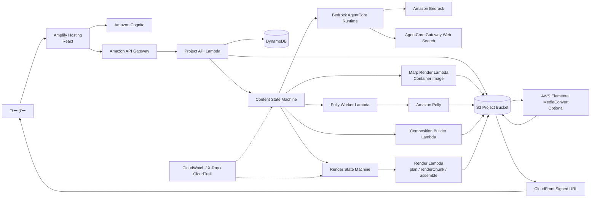

# スライド起点の生成AI動画アプリ設計書

- 製品名：未確定。設計書とコードでは`{productSlug}`として扱う。確定手順は名称の確定手順に定める
- 文書バージョン：2.0
- 作成日：2026-08-05
- 最終更新：2026-08-05
- 設計方針：**生成AIで作ったLTスライドを正本とし、Amazon Pollyの読み上げ、字幕、演出を追加してMP4も生成する**
- 動画レンダラー候補：[Hyperframes](https://github.com/heygen-com/hyperframes)

## 1. 概要

- **課題**：登壇用スライドは作れても、SNSで視聴される形式にする工程が手作業で残る。
- **解決**：スライドを正本とし、発表者ノートの読み上げ、同期字幕、演出を加えて動画まで自動生成する。
- **構成**：Bedrockでスライドと発表者ノートを生成、Marp CLIで画像化、Pollyで音声とspeech marksを生成、レンダラーがMP4を出力。実行はStep FunctionsとLambda、成果物はS3。
- **成果物**：Markdown、PDF、PPTX、フルLT動画、X向け短尺動画、字幕（VTT / SRT）、投稿文。
- **単価**：3分1080pのフル動画1本で約66円（目標100円以内）。主因はレンダリングではなく生成処理。
- **計画**：自作アプリを本命とし、上流OSSへの機能提案と、源内AIアプリAPI仕様準拠版を派生トラックとして進める。3トラックは同一のコアを共有する。
- **未確定**：製品名。公開直前に決める。設計書とコードでは`{productSlug}`として扱う。

## 2. 結論

Hyperframesは本アプリの動画レンダラーとして有力であり、第一候補にする。ただしHyperframesにスライドそのものを再設計させるのではなく、次の責務分担とする。

- **Amazon Bedrock / AgentCore**：LTの構成、Marp Markdown、発表者ノートを生成する。
- **Marp CLI**：同じMarkdownからPDF、PPTX、HTML、スライド別PNGを生成する。
- **Amazon Polly**：各スライドの発表者ノートを読み上げ、音声とspeech marksを生成する。
- **Hyperframes**：スライドPNG、Polly音声、字幕、トランジションを時間軸に配置し、動画をレンダリングする。
- **AWS Lambda + Step Functions + S3**：HyperframesをAWSアカウント内で分散実行する。
- **AWS Elemental MediaConvert**：必要な場合だけ、最終的な配信用トランスコードや複数品質の生成に使う。

重要な判断は次の2点である。

1. **Marp Markdownがコンテンツの正本**であり、動画用HTMLや動画Manifestは派生物とする。
2. Hyperframesの`/slideshow`機能は使わない。公式ガイドではインタラクティブなデッキ全体を線形MP4へ直接書き出せないため、スライド画像を入力とする**通常の動画コンポジション**を生成する。

この構成により、1つの承認済みスライド資産から、登壇用成果物、音声付きフル動画、X向け短尺動画を一貫して生成できる。

## 3. 目標

### 3.1 プロダクト目標

エンジニアがテーマやURLを入力すると、次の成果物をまとめて取得できるアプリを作る。

1. LT登壇用のMarp Markdown
2. PDF
3. PPTX
4. HTMLスライド
5. Amazon Pollyによる音声付きフル動画
6. 字幕付きのX向け短尺動画
7. X投稿文と出典一覧

### 3.2 「Xでバズりやすい」の扱い

動画形式だけでバズを保証することはできない。本アプリでは、バズを保証するのではなく、視聴されやすい条件を生成工程へ組み込む。

- 最初の1～2秒に問題提起または結論を表示する。
- 無音でも理解できる大きな字幕を付ける。
- X向け短尺版は30～60秒を標準とする。
- 1シーン1メッセージにする。
- タイトルスライドを長時間表示せず、内容へ早く入る。
- フック、サムネイル、投稿文を各3案生成する。
- フルLT動画とは別に、重要スライドだけを選んだ短尺版を作る。
- 出典ページへのリンクを投稿文へ含められるようにする。

### 3.3 非目標

- Marpを廃止して動画専用フォーマットへ置き換えること
- 生成AIにLTとは別の動画コンテンツを一から作らせること
- 初期版でXへの自動投稿まで行うこと
- 権利不明の画像、音楽、人物音声を自動取得すること
- 映画品質の長尺映像編集を提供すること

## 4. 本アプリの独自価値

本アプリは、Marp Markdownを単一の正本として、登壇用スライドと配信用動画を一貫して生成する。

- **単一ソース**：同じMarp MarkdownからPDF、PPTX、HTML、スライド画像、MP4を生成する。
- **発表者ノートの活用**：各スライドのpresenter notesをAmazon Pollyの読み上げ原稿として使用する。
- **同期字幕**：Polly speech marksから字幕の表示時刻を生成し、無音でも理解できる動画にする。
- **用途別動画**：全スライドを使うフルLT動画と、承認済みスライドを選んだ30～60秒のX向け短尺動画を出力する。
- **決定的な演出**：Hyperframesでトランジション、ズーム、字幕をフレーム時刻に基づいて配置する。
- **部分再生成**：スライド全体を作り直さず、1枚の音声、字幕、動画区間だけを更新できるようにする。
- **成果物の一貫性**：スライド、音声、動画、投稿文を同じdeckVersionへ関連付け、内容の食い違いを防ぐ。

中心価値は、**登壇に使えるスライドとSNSで視聴できる動画を、同じ承認済みソースから作ること**にある。

### 4.1 実装原則

- 要件、命名、データモデル、API、UI文言、プロンプト、テーマを本アプリ向けに定義する。
- AWSサービスと採用OSSの公式仕様および公開APIを実装根拠とする。
- 採用OSSのライセンス条件を確認し、必要なライセンス文書と帰属表示を保持する。

## 5. プロジェクト計画

本プロジェクトは3つのトラックで進める。3トラックは競合せず、同一のコア実装を共有する。

| トラック | 内容 | 位置づけ | 前提 |
|---|---|---|---|
| T1 | 完全な自作アプリとして実現する | 本命。所有権と設計判断を自分に残す | なし |
| T2 | 動画部分だけを切り出し、Spec-Driven Presentation Makerへ提案する | 外部実績づくり。採否は相手の判断 | T1のPhase 0 |
| T3 | 源内AIアプリAPI仕様に準拠し、T1の機能を再現する | 公的基盤へ接続可能な実装という位置づけ | T1のPhase 1 |

### 5.1 トラック間で共有するコア

3トラックの違いは、入力の受け取り方と結果の返し方だけである。動画を作る処理は1つに保つ。

```text
配信アダプタ（トラックごとに差し替え）
  ├─ T1：自作Web UIと独自REST API
  ├─ T2：上流ツールのツール境界に合わせた最小インターフェース
  └─ T3：源内AIアプリAPI（/requests、/status/{id}、progress、artifacts）
                    │
                    ▼
共通コア（配信経路に依存しない）
  入力アダプタ    Marp Markdown / PPTX / PDF / スライド画像
  原稿抽出        発表者ノートまたは指定テキスト
  音声生成        Amazon Polly（音声とspeech marks）
  字幕生成        speech marksから字幕とVTT/SRT
  尺の確定        実測した音声長からスライド開始時刻を算出
  合成            コンポジション生成とレンダリング
  出力            MP4（フル尺と短尺）
```

この分離を設計の前提とする。コアは配信プロトコルを知らず、アダプタが仕様差を吸収する。トラックを増やしてもコアは変更しない。

### 5.2 トラック1：完全な自作アプリとして実現する

**目的**：本設計書の全機能を自分の実装として完成させる。所有権、設計判断、公開の主導権を保持する。

**スコープ**：本設計書に記載する全範囲。入力から動画出力、品質保証、監視、コストまで。

**成果物**

- 自作リポジトリ（IaCを含む）
- フルLT動画（16:9、音声と字幕つき）
- X向け短尺動画
- 本アプリ自身で生成した紹介動画

**完了条件**

- 承認済みスライドから、同一内容のPDF、PPTX、音声付きMP4を取得できる
- 本アプリの紹介動画を本アプリ自身で生成できる

**優先度**：最優先。T2とT3の前提となる。

### 5.3 トラック2：動画部分を切り出してSpec-Driven Presentation Makerへ提案する

**対象**：[aws-samples/sample-spec-driven-presentation-maker](https://github.com/aws-samples/sample-spec-driven-presentation-maker)（MIT-0、Python、CDK）

**調査で確認した事実**

- 開発が活発で、リリース間隔が短い
- 直近40件のPRのうち、人間によるPRは単一メンテナのものだけで、外部コントリビューターのPRは確認できなかった
- 一方で外部Issueには応答実績がある

**受け入れ要件**（同リポジトリのCONTRIBUTING.mdより）

- `make all`（ruffとpytest）を通す
- AWS Automated Security Helperを`--fail-on-findings`で通す
- Conventional Commitsに従う
- 全public関数にdocstringと型ヒントを付ける
- ファイル冒頭にAmazonの著作権表記とSPDX識別子`MIT-0`を記載する
- ビジネスロジックは`sdpm/sdpm/`のエンジン層へ集約する

**進め方**：大型の機能PRを最初に出さない。3段階で進める。

1. 既存の未修正バグに対する小さなPRを出す。着手前にIssueへ意思表明する
2. 動画エクスポートを機能提案Issueとして出す。ユースケース、スコープ、非スコープ、外部依存、運用コストへの影響を明記する
3. 合意が得られた場合のみ実装PRを出す。得られない場合は外部サービス連携としてT1側に留める

**スコープの制約**：FFmpegとヘッドレスブラウザを持ち込むと、上流の運用コストとセキュリティスキャンの範囲が変わる。提案は「生成済みのPPTXまたはPDFを外部の動画化サービスへ渡す薄い連携」に絞る。

**完了条件**：マージされたPRが1件以上ある、または動画機能の提案Issueが記録されている。

**明記事項**：PRの採否は相手の判断である。本プロジェクトの成否をT2に依存させない。

### 5.4 トラック3：源内AIアプリAPI仕様に準拠してT1の機能を再現する

**対象**：源内（デジタル庁が開発・運用する生成AI利活用基盤）。AIアプリは源内Webと独立した環境で構築し、GUI操作で登録する方式が採られている。

**準拠する仕様**：源内WebのAIアプリAPI仕様。仕様には2026年3月時点のものであり今後変わる可能性があるとの注記がある。

**実装要件**

| 項目 | 仕様 |
|---|---|
| 認証 | `x-api-key`ヘッダー |
| ネットワーク | 源内Web側の外部アプリ用IPアドレスのみ許可するIP制限 |
| 入力フォーム | リクエスト形式JSONで定義し、利用者向け画面は自動生成される |
| 利用コンポーネント | `file`（`accept`、`multiple`、`max_size`、`max_file_count`）、`select`、`radio`、`textarea`、`hidden` |
| リクエスト | `inputs`でラップする。ファイルはBase64 |
| 非同期の起動 | `POST .../requests`。登録時はエンドポイント末尾に`/requests/`を付す |
| 受付レスポンス | `202 Accepted`、`request_id`、`status`、`status_url` |
| 進捗確認 | `GET /status/{request_id}` |
| 状態 | `PENDING` / `IN_PROGRESS` / `COMPLETED` / `ERROR` |
| 進捗表示 | `progress`に進捗文字列を入れる |
| 完了時 | `outputs`（Markdown可）と`artifacts`（`contents`はBase64、`display_name`） |
| 失敗時 | `error.message`と`error.details` |

**注意**：`max_size`はBase64変換後の値で検証される。入力上限の設計はこの前提で行う。

**設計判断：成果物を2経路に分ける**

`artifacts`はBase64であるため、フル尺1080pのMP4を載せることは現実的でない。次のとおり分離する。

- X向け短尺（30〜60秒、低ビットレート）は`artifacts`に載せる
- フルLT動画は`outputs`のMarkdownへ期限付きダウンロードリンクとして記載する

**状態の対応付け**

| 本設計書の状態 | 仕様の`status` | `progress`の例 |
|---|---|---|
| SLIDE_GENERATING | IN_PROGRESS | 構成を生成しています |
| SLIDE_RENDERING | IN_PROGRESS | スライド画像を生成しています 4/12 |
| VOICE_GENERATING | IN_PROGRESS | 音声を合成しています 7/12 |
| COMPOSITION_BUILDING | IN_PROGRESS | 合成の準備をしています |
| VIDEO_RENDERING | IN_PROGRESS | 動画をレンダリングしています 40% |
| VIDEO_QA | IN_PROGRESS | 出力を検査しています |
| COMPLETED | COMPLETED | 完了しました |
| FAILED | ERROR | 該当なし |

仕様にキャンセル状態は定義されていない。`CANCELLED`は`ERROR`として返し、`error.message`で理由を示す。

**プロトコル層の分離**：仕様が変更中であるため、アダプタとして独立させ、適合テストを用意する。参照した仕様の版を記録し、差分が出た時点でアダプタのみを更新する。

**ライセンスと引用**：源内のソフトウェアはMIT、ドキュメントはCC BY 4.0で公開されている。仕様文書を引用する場合は帰属表示を行う。

**貢献方針**：源内のリポジトリはPull Requestを受け付けていない。Issueも致命的な問題に限定されている。本トラックでは自環境での準拠実装のみを行い、本体への変更提案は行わない。

**完了条件**：自AWS環境へデプロイした準拠実装が、仕様どおりのリクエストとレスポンスで動作し、登録手順に必要な出力（エンドポイントとAPIキー）を提供できること。実際の源内環境への登録は管理者権限と対象チームを持つ主体の判断に依るため、本計画の完了条件には含めない。

### 5.5 実施順序とゲート

```text
ゲート1：T1 Phase 0（技術検証）完了
   └→ T2 Step 1（小さなPR）を並行開始できる

ゲート2：T1 Phase 1（フル動画のE2E）完了
   ├→ T2 Step 2（動画機能の提案Issue）を開始できる
   └→ T3（源内準拠アダプタの実装）を開始できる
```

動画が実際に動く前に外部へ提案しない。実物のない提案は説得力を持たないためである。

### 5.6 トラック別リスクと対応

| トラック | リスク | 対応 |
|---|---|---|
| T1 | スコープ拡大で完了しない | Phase 0とPhase 1の完了条件を固定し、9:16と演出強化を後段へ回す |
| T2 | 大型PRが受け入れられない | 先にIssueで合意形成し、実装は合意後に行う |
| T2 | 上流の変更速度が速くコンフリクトする | 変更範囲を小さく保ち、フォークを頻繁に同期する |
| T3 | 仕様が変更される | プロトコルをアダプタへ隔離し、適合テストと仕様の版管理を行う |
| T3 | `artifacts`のサイズ上限に収まらない | 短尺は`artifacts`、フル尺は期限付きリンクの2経路にする |
| T3 | 自分では源内環境へ登録できない | 完了条件を自環境での仕様適合検証に置く |
| 共通 | コアが配信経路に依存して再利用できない | 配信アダプタとコアの境界をレビュー項目に含める |
| 共通 | 出自を誤解される | 参照した公開実装と準拠仕様を謝辞として明記する |

## 6. 非機能要件

数値目標を先に固定する。これを満たさない実装は未完成として扱う。

### 6.1 性能目標

| 指標 | 目標 | 測定方法 |
|---|---|---|
| スライド生成 | p95 90秒以内 | API受付から`SLIDE_READY`まで |
| フル動画生成（3分尺） | p95 8分以内 | `SLIDE_APPROVED`から`COMPLETED`まで |
| 短尺動画生成 | p95 3分以内 | 同上 |
| 音声と字幕のずれ | 100ms以内 | speech marksと字幕`startMs`の差 |
| 音声と映像のずれ | 累積100ms以内 | `startMs`合計と実測動画長の差 |

### 6.2 信頼性目標

| 指標 | 目標 |
|---|---|
| 動画生成の成功率 | 一時障害の自動再試行後に99%以上 |
| 同一入力の再現性 | 同じManifestから生成した動画のフレームハッシュが一致 |
| 部分再生成 | 1枚の音声修正で全体を作り直さずに動画を更新できる |

### 6.3 コスト目標

単価と月間上限はコスト設計に定める。ジョブ開始前に概算を提示し、月間上限に達した時点で新規ジョブを拒否する。

## 7. 技術選定

### 7.1 動画レンダラー比較

| 候補 | 長所 | 短所 | 判定 |
|---|---|---|---|
| Hyperframes | HTML/CSS起点、エージェント向け、決定的レンダリング、音声・字幕、AWS Lambda対応、Apache 2.0 | 新しいプロジェクト、Marp直接入力なし、API変更リスク | **第一候補** |
| Remotion | React/TypeScript、実績とLambda基盤が成熟、フレーム制御が明示的 | Reactへの変換が必要、独自ライセンスの確認が必要 | 代替候補 |
| FFmpegのみ | 安定、軽量、自由度が高い | HTML演出、字幕アニメーション、プレビューUIを自作 | フォールバック |
| MediaConvertのみ | AWSマネージド、配信用変換に強い | HTML/CSSを描画できず、動的スライド演出には不向き | 最終変換のみ |
| Marp画像 + 単純FFmpeg | 最小構成でPoCが速い | 演出と編集性が弱い | Phase 0の検証用 |

### 7.2 Hyperframes採用判断

Hyperframesは、HTML、CSS、メディア、シーク可能なアニメーションをヘッドレスChromeでフレームごとに取得し、FFmpegでMP4へ変換する。今回の入力はMarpから生成したHTMLまたはPNGであり、Web技術との相性が良い。

採用理由：

- AIエージェントが生成しやすいプレーンHTMLを使う。
- `<audio>`と時間属性でPolly音声を配置できる。
- 字幕、チャート、トランジション用のCatalogがある。
- 同じ入力から同じフレームを生成する決定性を重視している。
- `@hyperframes/aws-lambda`がStep Functions、Lambda、S3による分散レンダリングを提供する。
- CDK Constructがあり、既存AWSアプリへ統合できる。
- Apache License 2.0で、レンダリング回数に応じたソフトウェア利用料がない。

注意点：

- Hyperframesのプレゼンテーション機能は、現時点でデッキ全体を1本の線形MP4へ直接エクスポートできない。
- Marpを認識する専用アダプターは確認できない。このためMarp CLIのPNG出力を正式な境界にする。
- 調査時点の`@hyperframes/cli`と`@hyperframes/aws-lambda`は`0.7.92`であり、まだ1.0未満である。採用時はnpm公開版を確認し、完全一致バージョンで固定する。
- Lambda版はNode.js 22以上、Chromium、FFmpegを使用する。
- AWS Lambdaレンダリングは現時点でSDRのみであり、完了Webhookはない。
- 新しいプロジェクトなので、最初に1本の実動画で画質、音声同期、日本語フォント、コストを検証する。

### 7.3 採用する構成

```text
Marp Markdown
  ├─ PDF / PPTX / HTML         Marp CLI
  ├─ slide-001.png ...         Marp CLI --images png
  ├─ presenter-notes.txt       Marp presenter notes
  └─ video-manifest.json       スライド番号と動画設定
              │
              ├─ voice-001.mp3          Amazon Polly
              ├─ speech-marks-001.json  Amazon Polly
              ├─ captions.json          字幕変換Lambda
              └─ index.html             Hyperframes composition builder
                         │
                         └─ MP4           Hyperframes on AWS Lambda
```

### 7.4 レンダラーポートとフォールバック

動画出力という中核機能を、1.0未満の単一ライブラリへ直結させない。バージョン固定は延命であり対策ではないため、**差し替え可能な境界を設計に入れる**。

コアはこのポートだけを知る。

```typescript
// 動画レンダラーのポート。実装差はこの境界の内側に閉じる。
export interface VideoRenderer {
  /** 入力から総フレーム数とチャンク分割計画を作る */
  plan(input: RenderInput): Promise<RenderPlan>;
  /** 指定チャンクのフレームを生成し、中間成果物のS3キーを返す */
  renderChunk(plan: RenderPlan, chunkIndex: number): Promise<ChunkResult>;
  /** 中間成果物と音声を結合し、最終MP4のS3キーを返す */
  assemble(plan: RenderPlan, chunks: ChunkResult[]): Promise<RenderOutput>;
}
```

実装は2つ用意する。

| 実装 | 位置づけ | 用途 |
|---|---|---|
| `HyperframesRenderer` | 既定 | 演出、字幕アニメーション、トランジションを伴う本番出力 |
| `FfmpegRenderer` | フォールバック | 静止画と音声の連結のみ。演出なし。Phase 0の検証と障害時の代替 |

決定事項。

- **Phase 0で両方を実装する。** 片方だけ作ると、依存先の破壊的変更時に代替手段が存在しない状態になる。
- 両実装に**同一の契約テスト**を通す。入力Manifestを与え、出力MP4の解像度、fps、音声ストリーム、総尺、先頭と末尾フレームを検証する。実装を切り替えてもテストは共通にする。
- レンダラーの選択はManifestとは独立した実行時設定とし、コードに固定しない。
- `RenderInput`はS3キーの集合とし、画像や音声のバイナリをポート経由で渡さない。

## 8. 正本となるスライド仕様

### 8.1 Marp Markdown

スライド生成・検証処理は、次を生成する。

- 完全なMarp Markdown
- 各スライドのMarpit presenter notes
- スライドごとの重要度
- 短尺動画への採用候補
- 読み上げ禁止の出典URLや補足情報

発表者ノートには、そのスライドを実際に登壇で説明するときの自然な口調を記載する。スライド上の文をそのまま読み上げない。

### 8.2 スライド品質ルール

- 16:9を標準とする。
- 1枚につき1つの主張を置く。
- X動画でも読めるよう、本文の文字量を減らす。
- コードは重要行だけに絞り、動画ではハイライト位置を指定する。
- 数値や最新情報には出典を持たせる。
- 画像内に細かい文字を入れない。
- タイトル、本文、コード、出典で最小フォントサイズを定める。
- PDF/PPTXと動画で同じテーマCSSと日本語フォントを使う。

### 8.3 Marpから画像への変換

Marp CLIはスライドごとのPNG出力を公式にサポートする。

```bash
marp --images png --image-scale 2 deck.md
```

出力例：

```text
deck.001.png
deck.002.png
deck.003.png
```

MVPではPNGを動画レンダラーへ渡す。これにより、PDF/PPTXと動画でレイアウトが変わる問題を避けられる。

将来、箇条書きやコードを要素単位でアニメーションさせる場合は、Marp HTMLを解析してHyperframes DOMへ移す「DOMモード」を追加する。ただしPNGモードを常に残し、表示の忠実性を保証する。

## 9. 動画Manifest

Marpが内容の正本であり、`video-manifest.json`は動画に必要な時間情報だけを保持する。

```json
{
  "schemaVersion": "1.1",
  "deckId": "deck_01",
  "deckVersion": 3,
  "locale": "ja-JP",
  "voice": {
    "voiceId": "Takumi",
    "engine": "neural",
    "sampleRate": "24000"
  },
  "outputs": {
    "fullVideo": {
      "compositionId": "lt-full",
      "width": 1920,
      "height": 1080,
      "fps": 30,
      "videoBitrateKbps": 6000
    },
    "teaser16x9": {
      "compositionId": "x-teaser-16x9",
      "width": 1920,
      "height": 1080,
      "fps": 30,
      "videoBitrateKbps": 2500,
      "targetDurationSec": 45,
      "hookText": "生成AIの弱点は、検索で埋められる",
      "ctaText": "詳細はスライドで"
    },
    "teaser9x16": {
      "compositionId": "x-teaser-9x16",
      "width": 1080,
      "height": 1920,
      "fps": 30,
      "videoBitrateKbps": 2500,
      "targetDurationSec": 45,
      "layout": "slide-card"
    }
  },
  "captions": {
    "styleId": "default-ja",
    "maxCharsPerLine": 20,
    "maxLines": 2,
    "minDurationMs": 1200,
    "captionsKey": "captions/captions.json",
    "vttKey": "captions/full.ja.vtt",
    "srtKey": "captions/full.ja.srt"
  },
  "slides": [
    {
      "slideNumber": 1,
      "imageKey": "slides/deck.001.png",
      "imageSha256": "b1946ac92492d2347c6235b4d2611184",
      "presenterNote": "今日は、生成AIの弱点を補う新しいWeb検索機能を紹介します。",
      "teaserNote": "生成AIの弱点は、検索で埋められます。",
      "keyPoints": [
        "弱点は最新情報",
        "検索で補完する",
        "出典が残る"
      ],
      "voiceKey": "audio/slide-001.pcm",
      "speechMarksKey": "audio/slide-001-marks.json",
      "measuredAudioMs": 5980,
      "leadInMs": 120,
      "leadOutMs": 400,
      "durationMs": 6500,
      "startMs": 0,
      "transition": "fade",
      "importance": "HIGH",
      "includeInXTeaser": true
    }
  ]
}
```

Manifestの決定事項は次のとおり。

- `keyPoints`は9:16の`slide-card`レイアウトと字幕強調で使う。**後から足すとPolly再生成が必要になるため、スライド生成時に必ず作る。**
- `teaserNote`は短尺用に短縮した原稿を保持する。主張は`presenterNote`と同一にする。
- `durationMs`はLLMの推測値を使わない。`measuredAudioMs`に`leadInMs`と`leadOutMs`を加えた値とする。
- `measuredAudioMs`はPollyの応答ではなく、生成した音声ファイルの実測値を入れる。取得方法は音声長の確定に従う。
- `startMs`は先行スライドの`durationMs`の累積であり、レンダラーに計算させない。
- `imageSha256`と`voice`は再利用判定に使う。同じ値なら既存素材を使い回す。

## 10. Amazon Polly設計

### 10.1 音声生成

各スライドのpresenter notesをSSMLへ変換し、**同じText、Voice、Engineで2回呼び出す**。

1. 音声を生成する。出力形式は`pcm`を既定とする。
2. speech marksを生成する。`SpeechMarkTypes`は`word`と`sentence`を要求する。

speech marksは音声の代わりに返るため、1回の呼び出しで音声と時刻情報を同時に取得できない。2回呼び出しを前提に設計する。

### 10.2 文字数上限と呼び出し方式

`SynthesizeSpeech`の入力は**合計6,000文字、うち課金対象3,000文字**が上限である。超える場合は`StartSpeechSynthesisTask`（合計200,000文字、うち課金対象100,000文字）を使う。SSMLタグは課金対象文字数に含まれない。出典は[TextLengthExceededException](https://docs.aws.amazon.com/botocore/latest/reference/services/polly/client/exceptions/TextLengthExceededException.html)と[長い音声ファイル](https://docs.aws.amazon.com/polly/latest/dg/asynchronous.html)。

実装規則。

- スライド1枚のpresenter notesは課金対象3,000文字以内に収める。スライド生成時に検証する。
- 3,000文字を超えた場合は`StartSpeechSynthesisTask`へ切り替える。この経路はS3出力の非同期処理であり、完了待ちが必要になる。
- 上限超過を黙って切り詰めない。検証エラーとして返し、原稿の分割を促す。
- speech marks側も同じ上限が適用される。音声が通ってspeech marksが落ちる状態を作らない。

### 10.3 課金は文字数の2倍になる

Pollyは**音声とspeech marksの両方を文字数で課金する**。本設計は同じテキストで2回呼ぶため、**実効課金文字数は原稿の2倍**になる。

エンジン別の単価は次のとおり（[Amazon Polly料金](https://aws.amazon.com/polly/pricing/)、2026-08-05確認）。

| エンジン | 単価（100万文字あたり） | 課金対象 | 本設計での扱い |
|---|---|---|---|
| Standard | $4.00 | 音声とspeech marks | 低コスト検証用 |
| Neural | $16.00 | 音声とspeech marks | **既定** |
| Long-Form | $100.00 | 音声とspeech marks | オプトインのみ。費用警告を必須にする |
| Generative | $30.00 | 料金ページの記載は音声のみ | 字幕同期が必須のため既定にしない |

決定事項。

- **Neuralを既定とする。** Long-FormはNeuralの6.25倍であり、3,000文字の原稿では2回呼び出しで$0.60に達する。ほかの全工程の合計を上回るため、ユーザーが明示的に選んだ場合だけ許可する。
- Generativeは料金ページ上でspeech marksの記載がない。採用する場合は事前にspeech marks対応を検証し、対応しない場合は字幕生成に使わない。
- 原稿ハッシュ、Voice、Engineが同一なら音声とspeech marksを再利用し、2回課金を繰り返さない。

### 10.4 音声長の確定と音ズレ対策

MP3はエンコーダ遅延とフレーム境界の影響で、先頭と末尾に意図しない無音が入る。スライドを跨いで累積すると後半で音ズレが顕在化する。

対策を設計に固定する。

- Pollyからは`pcm`で取得する。配布用の圧縮は合成後に行う。
- `measuredAudioMs`はPollyの応答値ではなく、**生成した音声ファイルの実測値**を使う。PCMはサンプル数とサンプリングレートから算出し、圧縮音声を扱う場合は`ffprobe`で実測する。
- speech marksの最終`time`は`measuredAudioMs`の検証にのみ使い、尺の決定には使わない。末尾の無音が含まれないためである。
- `durationMs`は`leadInMs + measuredAudioMs + leadOutMs`とする。`leadOutMs`は次スライドへの間として400ms程度を既定にする。
- `startMs`は先行スライドの`durationMs`の累積とし、レンダラー側で再計算させない。
- 累積誤差を検出するため、`startMs`の合計と最終動画長の差を品質保証で検査する。

### 10.5 音声選択

- `DescribeVoices`で日本語とEngineの対応を実行時に確認する。
- 音声名やEngineをコードに固定せず、Manifestの`voice`と設定ファイルで指定する。
- ユーザーが声、速度、間を試聴してから最終動画を生成できるようにする。
- AWS固有名詞やサービス名はLexiconまたはSSMLの`phoneme`で補正する。
- 読み上げ速度を上げすぎず、原稿を短くすることで尺を調整する。

### 10.6 字幕

speech marksを日本語の意味単位へまとめ、レンダラー用の字幕JSONと、配布用の字幕ファイルを生成する。

**成果物を3種類出す。**

| 成果物 | 用途 |
|---|---|
| `captions.json` | レンダラーが焼き込む字幕。強調やハイライト情報を含む |
| `full.ja.vtt` | WebVTT。Web配信とプレイヤー表示用 |
| `full.ja.srt` | SubRip。SNS投稿と外部ツール連携用 |

VTTとSRTを出す理由は、焼き込み字幕だけでは再利用できないためである。動画への流用、アクセシビリティ、検索性がまとめて改善する。

字幕の生成規則。

- 1字幕は原則1～2行、1行20文字を既定の上限とする。
- 最小表示時間を1,200msとし、これを下回る字幕は前後へ結合する。
- 助詞の直前など不自然な位置で改行しない。
- 音声より先に字幕を消さない。`endMs`は対応する語の終了時刻以降に置く。
- `keyPoints`に含まれる語を強調対象にする。
- スライドの重要部分を隠さない位置へ配置する。
- 無音再生でも理解できることを確認する。

## 11. Hyperframesコンポジション設計

### 11.1 生成方式

`CompositionBuilderFunction`が、スライド画像と音声情報からHyperframes用の`index.html`を生成する。

概念例：

```html
<div
  id="stage"
  data-composition-id="lt-full"
  data-start="0"
  data-width="1920"
  data-height="1080"
  data-fps="30"
>
  
  <audio
    data-start="0"
    data-duration="6.2"
    data-track-index="1"
    src="assets/slide-001.mp3"
  ></audio>
</div>
```

実装では全スライドの開始秒を累積計算し、字幕レイヤー、トランジション、ロゴを追加する。

### 11.2 演出方針

スライドを見せることが主目的なので、演出は内容を邪魔しない範囲に限定する。

- スライド切替時の短いfadeまたはpush
- 静止画にごく弱いズーム
- コードスライドの注目行を枠で強調
- 重要語に同期した字幕ハイライト
- 章の切替だけ軽いサウンドエフェクト
- 冒頭1～2秒のフックテキスト
- 最後にスライドURLまたはアプリ名を表示

すべての動きはフレーム時刻から決まり、wall clock依存のアニメーションを避ける。

### 11.3 生成する動画

#### フルLT動画

- 全スライドを順番に使用
- 16:9、1080p、30fps
- presenter notesをすべて読み上げる
- PDF/PPTXと同じ内容
- 数分程度の技術解説を想定

#### X向け短尺動画

- `importance=HIGH`のスライドから3～6枚を選ぶ
- 30～60秒
- 冒頭にフックを追加
- presenter notesを短尺用に短縮するが、主張は変更しない
- まず16:9版を正式出力とする
- 必要に応じて9:16版も作る

9:16版では16:9スライドを単純クロップしない。上部にスライド全体、下部に拡大した要点と字幕を置く「slide card」レイアウトを使う。元スライドを出発点としつつ、モバイルで読める情報量にする。

## 12. AWSアーキテクチャ



### 12.1 AWSサービスの責務

| サービス | 責務 |
|---|---|
| Amplify Hosting | React UIの配信 |
| Cognito | ログインとユーザー識別 |
| API Gateway | Project、Job、Download API |
| AgentCore Runtime | 対話、検索、Marp生成、修正 |
| Bedrock | LT構成、スライド、発表者ノート、短尺要約 |
| AgentCore Gateway Web Search | 最新情報と出典の取得 |
| Lambda | Marp変換、Polly連携、字幕、Composition生成 |
| Polly | 読み上げ音声とspeech marks |
| Step Functions Standard | 生成工程とHyperframes分散レンダリング |
| S3 | Markdown、PNG、音声、字幕、中間チャンク、MP4 |
| DynamoDB | Project、Version、Job、利用枠、冪等性 |
| Hyperframes Lambda adapter | Plan、RenderChunk、Assemble |
| MediaConvert | 任意の配信用変換、派生品質、サムネイル |
| CloudFront | 期限付き成果物配信 |
| CloudWatch / X-Ray / CloudTrail | メトリクス、トレース、監査 |

カスタムLambdaはTypeScript / Node.jsとAWS SDK for JavaScript v3で実装し、Marp変換とHyperframesを含めて本番と同じ技術スタックで検証する。Bedrockのテキスト生成は原則Converse APIを使い、すべての呼び出しで`maxTokens`を用途に合わせて明示する。モデルIDとInference Profileはデプロイ対象リージョンで確認し、未検証のIDをコードへ固定しない。

### 12.2 Hyperframes AWS Lambda構成

`@hyperframes/aws-lambda`のCDK Constructを使用する。SAM CLIに依存するデプロイ経路ではなく、アプリ全体のCDK TypeScriptへ統合する。

Hyperframesの状態機械は次の処理を行う。現行adapterはPlan、RenderChunk、Assembleごとに別Lambdaを作るのではなく、**1つのLambda関数がイベントの`Action`に応じて3処理を振り分ける**。RenderChunk段階では、同じ関数をStep FunctionsのMapから並列呼び出しする。

```text
Plan action
  -> Map(RenderChunk action 1..N)
  -> Assemble action
  -> S3へfinal.mp4
```

初期設定：

- Lambda Memory：1080p検証では10,240 MBを開始候補とする。単価に直結するため、実測後に必ず見直す。
- **Lambda エフェメラルストレージ：`/tmp`の既定は512 MBで、フレーム画像と中間動画には不足する。レンダラーは4,096 MB、Marp変換は2,048 MBを開始値とする（上限10,240 MB）。**
- Lambda Timeout：各チャンク15分以内。
- Reserved Concurrency：PoCは2～4、負荷試験後に調整する。
- Step Functions：Standard。
- Render bucket：Block Public Access、暗号化、ライフサイクル設定。
- Plan protocol：新規統合ではv2。
- バージョン：`@hyperframes/aws-lambda`とproducerを同じ完全一致バージョンに固定する。
- 出力：MP4、1080p、30fps、SDR。

Marp変換Lambdaはコンテナイメージで構成する。Chromium、Marp CLI、日本語フォント（Noto Sans CJK）を同梱し、フォントはレンダラー側のコンテナにも同一版を入れる。**PDF、PPTX、動画で字形が変わる事故は、フォントの版ずれで起きる。**

Hyperframesの状態機械実行ARNをProject Jobへ保存する。完了Webhookがない制限は、Step Functions Execution Status ChangeをEventBridgeで受けてProjectへ反映することで補う。

## 13. 処理フロー

### 13.1 スライド生成

1. ユーザーがLTテーマ、対象者、持ち時間、URLを入力する。
2. AgentCoreが必要な情報をWeb Searchで調べる。
3. BedrockがMarp Markdownとpresenter notesを生成する。
4. スライド検証処理がMarkdown構造、枚数、文字量、ノートの有無を検証する。
5. `deck.md`をS3へ保存し、DynamoDBへVersionを登録する。
6. プレビューを表示し、ユーザーが修正・承認する。

### 13.2 動画生成

1. 承認済み`deck.md`を読み込み、presenter notesとkeyPointsをスライド番号ごとに抽出する。
2. **次の2系列をParallelで同時に実行する。**
   - 系列A：Marp CLIでPDF、PPTX、HTML、スライド別PNGを生成する。
   - 系列B：Pollyでスライド別の音声とspeech marksを生成する。
3. 両系列の完了を待ち合わせる。
4. 音声ファイルの実測長から`measuredAudioMs`、`durationMs`、`startMs`を確定する。
5. speech marksから`captions.json`、`full.ja.vtt`、`full.ja.srt`を生成する。
6. Manifestを確定し、コンポジションとassetsを生成する。
7. レンダリング対象をstageする。
8. Render State Machineを開始する。
9. `plan`でチャンク分割し、MapでrenderChunkを並列実行する。
10. `assemble`が音声をミックスし、MP4をS3へ保存する。
11. 必要な場合はMediaConvertで配信用派生ファイルを生成する。
12. 自動QAを通した後、CloudFront署名URLを返す。

系列AとBを直列にしない理由は、PNG生成とPolly合成に依存関係がないためである。直列化すると体感速度がそのまま倍近くなる。

### 13.3 短尺版生成

1. Bedrockがスライドを重要度順に評価する。
2. ユーザーへ採用スライドと短縮原稿を提示する。
3. 承認後、短尺用Polly音声を生成する。
4. 同じスライドPNGから別のHyperframes Compositionを作る。
5. フック、字幕、CTAを追加してMP4へ出力する。

短尺版でもスライドの事実や結論を変更せず、説明の範囲だけを絞る。

## 14. 状態管理

```text
DRAFT
  -> SLIDE_GENERATING
  -> SLIDE_READY
  -> SLIDE_APPROVED
  -> ASSET_BUILDING            SLIDE_RENDERINGとVOICE_GENERATINGを並列実行
       ├─ SLIDE_RENDERING
       └─ VOICE_GENERATING
  -> TIMING_RESOLVED           実測音声長からdurationMsとstartMsを確定
  -> COMPOSITION_BUILDING
  -> VIDEO_RENDERING
  -> VIDEO_QA
  -> COMPLETED

処理中 -> FAILED | CANCEL_REQUESTED | CANCELLED
VIDEO_QA -> COMPLETED | NEEDS_REVISION
NEEDS_REVISION -> SLIDE_READY          スライド本文を直す場合
NEEDS_REVISION -> ASSET_BUILDING       原稿や音声だけを直す場合
NEEDS_REVISION -> COMPOSITION_BUILDING 演出や字幕だけを直す場合
```

決定事項。

- 動画生成前に`SLIDE_APPROVED`を必須にする。スライド修正のたびにPollyと動画レンダリング費用が発生することを防ぐ。
- `ASSET_BUILDING`は2系列の並列実行を表す。両方の完了を待って`TIMING_RESOLVED`へ進む。
- `TIMING_RESOLVED`を独立した状態にする理由は、尺の確定を明示的な検証点にするためである。ここで累積誤差と欠落を検出する。
- `NEEDS_REVISION`からの復帰先を3通り定義する。**修正範囲に応じて最小の工程だけを再実行する。** 全体を作り直さない。

## 15. API概要

| Method | Path | 用途 |
|---|---|---|
| POST | `/v1/projects` | Project作成 |
| POST | `/v1/projects/{id}/slides` | スライド生成開始 |
| GET | `/v1/projects/{id}/versions/{version}` | Markdownとプレビュー取得 |
| POST | `/v1/projects/{id}/versions/{version}/approve` | スライド承認 |
| POST | `/v1/projects/{id}/videos` | フル動画生成 |
| POST | `/v1/projects/{id}/videos/teaser` | X短尺動画生成 |
| GET | `/v1/jobs/{jobId}` | 進捗、段階、エラー取得 |
| POST | `/v1/jobs/{jobId}/cancel` | キャンセル要求 |
| POST | `/v1/projects/{id}/slides/{number}/voice` | 1枚の音声再生成 |
| POST | `/v1/projects/{id}/videos/{videoId}/rerender` | 動画再レンダリング |
| GET | `/v1/projects/{id}/deliverables` | PDF、PPTX、MP4等の一覧 |

変更系APIは`Idempotency-Key`を受け取り、同一操作の二重実行を防ぐ。大きいファイルをAPI Gateway経由で返さず、S3 presigned URLまたはCloudFront署名URLを使う。

## 16. S3構造

バケット名はグローバルに一意である必要があるため、次の命名規則に従う。製品名は未確定なので、確定時に1箇所を変えれば済む形にする。

```text
{productSlug}-{purpose}-{env}-{accountId}-{region}
例: ltvideo-projects-dev-000000000000-us-east-1
```

`productSlug`はCDKのcontextで与え、コードへ固定しない。

```text
s3://{productSlug}-projects-{env}-{accountId}-{region}/{userId}/{projectId}/
  source/
  versions/v0001/deck.md
  versions/v0001/deck.pdf
  versions/v0001/deck.pptx
  versions/v0001/slides/deck.001.png
  versions/v0001/slides/deck.002.png
  versions/v0001/audio/slide-001.pcm
  versions/v0001/audio/slide-001-marks.json
  versions/v0001/captions/captions.json
  versions/v0001/captions/full.ja.vtt
  versions/v0001/captions/full.ja.srt
  versions/v0001/video/video-manifest.json
  versions/v0001/video/hyperframes/index.html
  versions/v0001/output/lt-full-16x9.mp4
  versions/v0001/output/x-teaser-16x9.mp4
  versions/v0001/output/x-teaser-9x16.mp4
```

ソース、派生物、中間物、最終物をプレフィックスで分離する。中間チャンクと古いプレビューには短いライフサイクルを設定し、承認済みMarkdownと最終成果物は保持する。

## 17. セキュリティ

- Cognitoの`sub`とProject所有者をAPIごとに照合する。
- S3 Block Public AccessとCloudFront OACを使用する。
- Lambdaごとに役割を分け、Projectプレフィックスだけを許可する。
- HyperframesではStep Functions実行ロールとLambda実行ロールを分離し、相互に必要な操作だけを許可する。
- Bedrockのモデル権限を採用モデルに限定する。
- Bedrock Guardrailsは次の3方式を目的別に使う。
  - `ApplyGuardrail`：ユーザー入力、アップロード資料、検索結果をモデル呼び出し前に検査する。
  - `guardrailConfig`：Converseの入力と出力全体を包括的に検査する。
  - `guardContent`：信頼済みシステム指示を除外しつつ、ユーザー入力、検索結果、ツール結果などすべての未信頼コンテンツを選択的に検査する。
- 本番Guardrailは番号付きバージョンを固定し、traceを無効にする。IAM条件で必須Guardrailを外せないようにする。
- PIIマスキング後もモデル呼び出しログに元入力が残る可能性を考慮し、機密用途では呼び出しログを無効化するかKMS暗号化、アクセス制御、短い保持期間を設定する。
- Web検索結果は未信頼入力として扱い、プロンプト命令として実行しない。
- URL、MIME、ファイルサイズ、ページ数、Markdown HTMLを検証する。
- ユーザーが許可した素材だけを動画へ含める。
- ログへ原稿全文、音声データ、JWTを出力しない。
- CloudWatch Logsの保持期間を明示する。
- CloudTrailでBedrock、Step Functions、Lambda、S3操作を監査する。
- Apache 2.0のLICENSEと必要な帰属表示を配布物・リポジトリへ保持する。

## 18. 信頼性と冪等性

- Step Functions Standardを使う。
- State間で音声や画像を渡さず、S3キーだけを渡す。
- 実行名を`projectId-version-outputType`にする。
- 音声キーへ原稿、Voice、Engineのハッシュを含める。
- スライド画像キーへMarkdownとテーマのハッシュを含める。
- Hyperframes siteIdはcontent-addressed uploadを利用する。
- 同じ入力の再レンダリングでは既存素材を再利用する。
- 一時的なスロットリングだけ指数バックオフで再試行する。
- 検証エラー、権限エラー、Guardrail拒否は自動再試行しない。
- HyperframesのproducerとLambda ZIPのバージョン不一致をデプロイ時に検出する。
- 失敗したMap処理と最終失敗イベントをDLQへ送る。

## 19. 品質保証

### 19.1 自動検査

- Marpのスライド枚数、行数、はみ出し
- presenter notesの欠落
- 発表時間に対する原稿量
- PNGの解像度と欠落
- Polly音声とspeech marksの対応
- 字幕の1行文字数、表示時間、重なり
- 音声ファイルの無音、クリップ、長さ
- Hyperframes `lint`と`check`
- 先頭、中間、末尾フレームのスナップショット比較
- MP4のcodec、fps、解像度、音声ストリーム
- 動画全体の長さとスライド時間合計
- 最後の音声や字幕が途中で切れていないこと

### 19.2 人による確認

- LTとして話の流れが成立する。
- スライドと音声が同じ主張をしている。
- AWSサービス名や技術用語の発音が正しい。
- 音声あり、無音の両方で理解できる。
- X短尺版の最初の2秒でテーマが分かる。
- 出典と日付が確認できる。
- スマートフォン表示で文字が読める。

## 20. コスト設計

### 20.1 単価目標

| 指標 | 目標 |
|---|---|
| フルLT動画1本（3分、1080p、Neural） | 100円以下 |
| X向け短尺1本の追加 | 30円以下 |
| 1ユーザーの月間上限 | 事前設定した金額で強制停止 |

### 20.2 単価試算

前提：3分（180秒）、1080p、30fps、12スライド、presenter notes合計3,000文字、Polly Neural、1 USD = 150円。

| 項目 | 計算 | USD |
|---|---|---|
| Bedrock（構成・スライド・ノート生成） | 入力20,000＋出力8,000トークン、仮定単価$3／$15 per 1Mトークン | 0.180 |
| Polly Neural（音声） | 3,000文字 × $16／1M | 0.048 |
| Polly Neural（speech marks） | 3,000文字 × $16／1M | 0.048 |
| Marp変換Lambda | 3,008 MB × 60秒 = 176 GB秒 | 0.003 |
| レンダリング（renderChunk） | 5,400フレーム × 0.15秒 = 810秒、10,240 MB = 8,100 GB秒 | 0.135 |
| レンダリング（assemble） | 10,240 MB × 90秒 = 900 GB秒 | 0.015 |
| Step Functions | 約120状態遷移 × $0.025／1,000 | 0.003 |
| S3 | 約300リクエスト＋100 MB保存 | 0.005 |
| CloudFront | 50 MB × 1回配信 | 0.006 |
| **合計** | | **約0.44** |

約66円。目標の100円以内に収まる。

**Lambdaの単価根拠**：$0.0000166667 per GB秒、リクエスト$0.20 per 100万件、エフェメラルストレージ$0.0000000309 per GB秒（512 MBまで無料）。いずれも[AWS Lambda料金](https://aws.amazon.com/lambda/pricing/)の記載による。Step Functions Standardは1,000状態遷移あたり$0.025。

### 20.3 試算から得られた設計判断

- **コストの主因はレンダリングではなく生成である。** Bedrockが全体の4割を占め、Pollyの2回呼び出しが2割を占める。レンダリングは3割強にとどまる。したがって効く対策は再生成の抑制であり、承認ゲートとハッシュによる再利用が最も効果的である。
- **Long-Formを選ぶと単価が2.2倍になる。** 3,000文字の2回呼び出しで$0.60となり、この1項目でほかの全工程の合計を上回る。既定をNeuralとし、Long-Form選択時は費用差を提示して同意を得る。
- 1フレーム0.15秒という前提は未実測である。**Phase 0で必ず実測し、この表を更新する。** 実測値が0.3秒なら合計は約$0.58になる。
- 価格は変動する。実装時に料金ページで確認し、確認日を併記して記録する。

### 20.4 制御策

- スライド承認前は動画を生成しない。
- 音声だけを先に試聴できるようにする。
- Draftは720pまたは短い範囲だけをレンダリングする。
- Lambda Reserved Concurrencyを小さく開始する。
- 1ユーザーの同時動画ジョブ数を制限する。
- 月次利用枠とジョブ開始前の概算を表示する。
- 同じハッシュの音声、PNG、Hyperframes siteを再利用する。
- 中間チャンクへS3 Lifecycleを設定する。
- AWS BudgetsとCost Anomaly Detectionを設定する。

## 21. 生成品質の評価

メディア検査は「動画として壊れていないか」を見る。ここでは「**内容が正しいか**」を見る。動画が正常に出力されても、内容が誤っていれば成果物として不良である。

### 21.1 ゴールデンセット

代表的なLTテーマを10件固定し、変更のたびに同じ入力で評価する。テーマは技術解説、新機能紹介、事例、比較、入門を含める。入力、期待する構成、禁止事項をリポジトリに保存する。

### 21.2 評価項目と閾値

| 項目 | 判定方法 | 閾値 |
|---|---|---|
| 出典URLの到達性 | 生成された全URLへHEADリクエスト | 到達率100% |
| 引用内容の一致 | 主張と参照ページ本文の対応をLLMで判定 | 不一致0件 |
| 未裏付けの数値 | 数値表現に出典が紐づいているかを検査 | 0件 |
| 構成の妥当性 | 課題・解決・根拠・まとめの存在をLLMで採点 | 5点満点で4以上 |
| ノートの網羅 | 全スライドにpresenter notesとkeyPointsがあるか | 欠落0件 |
| 短尺化の主張保持 | 短縮前後の主張をLLMで同一性判定 | 不一致0件 |
| 文字量超過 | スライドごとの文字数と行数 | 規定値内 |
| 禁止表現 | 誇大表現と断定表現の検出 | 0件 |

### 21.3 実行方法

- 評価はCIで実行する。閾値を下回った場合はマージを止める。
- 判定に使うモデルと版を固定する。判定モデルを変えた場合は再ベースライン化する。
- 評価結果は履歴として保存し、プロンプト変更の影響を追跡できるようにする。
- 短尺化の主張保持は、元スライド番号とclaim IDの対応で機械的に検証する。LLM判定だけに依存しない。

## 22. CI/CDと環境戦略

### 22.1 環境

| 環境 | 用途 | デプロイ契機 |
|---|---|---|
| dev | 開発と結合確認 | ブランチへのpush |
| stg | 本番同等構成での検証 | mainへのマージ |
| prd | 本番 | 手動承認 |

環境差分は設定として外部化し、コードへ埋め込まない。

```text
cdk.json            デプロイ対象の一覧
parameter.ts        環境ごとの差分（dev / stg / prd）
config/*.toml       テーマ、音声、動画プリセット、モデルID
```

設定はスキーマ検証を通してから使う。検証は起動時ではなくデプロイ前に行い、不正な設定でデプロイできないようにする。`productSlug`もここで与える。

### 22.2 パイプライン

```text
1. lint            型チェックとフォーマット
2. unit            ユニットテスト
3. iac-test        CDK assertionsとスナップショット
4. contract        レンダラーポートの契約テスト（Hyperframes版とFFmpeg版）
5. eval            ゴールデンセットによる生成品質評価
6. deploy-dev      dev環境へデプロイ
7. e2e             1本の動画をE2E生成し、メディア検査を実行
8. deploy-stg      stg環境へデプロイ
9. approve         手動承認
10. deploy-prd     prd環境へデプロイ
```

### 22.3 テスト方針

- IaCはCDK assertionsでリソースの存在と主要プロパティを検証する。スナップショットは意図しない変更の検出に使う。
- レンダラーは契約テストを共通化し、実装を切り替えても同じテストが通ることを保証する。
- E2Eは短尺1本に限定する。フル尺をCIで毎回作らない。時間と費用が見合わない。
- 回帰用の参照動画を保持し、フレームハッシュの差分を検出する。
- 依存の更新はメジャーバージョンを自動マージしない。レンダラー関連は特に手動確認とする。

### 22.4 ロールバック

- インフラはCDKの前リビジョンへ戻す。
- Lambdaはバージョンとエイリアスで切り戻す。
- プロンプトと設定はバージョン管理し、デプロイと独立して戻せるようにする。
- 進行中のジョブは中断せず、新規ジョブのみ新版へ振る。

## 23. 監視

主要メトリクス：

- SlideGenerationSuccessRate
- MarpRenderDuration
- PollyCharacters
- PollyFailureRate
- HyperframesRenderDuration
- HyperframesChunkFailureRate
- RenderedFrames
- VideoDurationSeconds
- CostEstimatePerRender
- StepFunctionsFailedExecutions
- LambdaThrottles
- DLQDepth

`projectId`、`deckVersion`、`jobId`、`renderId`を全ログの相関IDとして使う。CloudWatch Dashboardで生成段階別の時間と失敗を表示し、Step Functions失敗、Lambdaスロットリング、DLQ滞留へアラームを設定する。

## 24. 実装ロードマップ

### Phase 0：技術検証

- 既存Marp 3～5枚をPNGへ出力する。
- 手書き原稿をPollyで`pcm`音声化し、speech marksを別呼び出しで取得する。
- 音声の実測長から尺を確定し、累積の音ズレが出ないことを確認する。
- **レンダラーポートを定義し、Hyperframes実装とFFmpeg実装の両方を作る。**
- **両実装に同じ契約テストを通す。**
- 1フレームあたりのレンダリング所要時間を実測し、単価試算を更新する。
- 日本語フォント、字幕、MP4互換性を確認する。
- 同じ入力から同じフレームが生成されることを確認する。

終了条件：手元のLTスライドから音声付き16:9 MP4を安定して1本作れる。かつ2実装のどちらでも契約テストが通る。

### Phase 1：MVP

- BedrockでMarp、presenter notes、`keyPoints`を生成する。
- Marp LambdaでPDF/PPTX/PNGを生成する。
- Polly音声、speech marks、字幕JSON、VTT、SRTを生成する。
- PNG生成とPolly合成を並列実行する。
- レンダラーのCDK Constructを導入する。
- フルLT動画をS3へ出力する。
- Job進捗と成果物ダウンロードを実装する。
- ゴールデンセットによる生成品質評価をCIへ組み込む。

終了条件：スライドを承認して、同じ内容のPDF、PPTX、MP4、字幕を取得できる。**さらに本アプリの紹介動画を本アプリ自身で生成し、公開できる状態にする。**

### Phase 2：X向け短尺版

- 重要スライド選択と短尺原稿を生成する。
- フック3案、字幕スタイル、サムネイルを生成する。
- 16:9短尺版を生成する。
- 9:16 slide cardテンプレートを追加する。
- 投稿文と出典ページを生成する。

終了条件：フルLTから30～60秒の短尺動画を追加生成できる。

### Phase 3：品質と運用

- シーン単位の音声・動画再生成
- ブランドテーマ
- コード行ハイライト
- A/B版管理
- 利用枠、費用見積もり、Budgets
- CloudWatch Dashboardとアラーム
- レンダラーの回帰テスト

### Phase 4：任意拡張

- Marp HTMLのDOMモード
- MediaConvertによる複数配信品質
- Nova Canvasによる補助背景。ただしスライドが主役であることを維持する。
- ユーザー承認を前提としたBGMライブラリ

## 25. 受け入れ条件

| # | 条件 | 判定値 |
|---|---|---|
| 1 | 生成された`deck.md`がMarpとして表示できる | エラー0件 |
| 2 | 同一`deck.md`からPDF、PPTX、スライド別PNGが作られる | 枚数が3形式で一致 |
| 3 | 全スライドにpresenter notesと`keyPoints`がある | 欠落0件 |
| 4 | Polly音声がスライド番号と正しく対応する | 不一致0件 |
| 5 | 字幕が音声と同期する | ずれ100ms以内 |
| 6 | 字幕がスライドの要点を隠さない | 目視確認で不良0件 |
| 7 | 16:9のMP4が生成される | 1920x1080、30fps、音声ストリームあり |
| 8 | MP4のスライド順がPDFと一致する | 全スライドで一致 |
| 9 | 動画末尾で音声と字幕が切れない | 末尾欠落0件 |
| 10 | 動画の総尺が`startMs`の合計と一致する | 差分100ms以内 |
| 11 | 字幕がVTTとSRTで出力される | 両形式が生成され再生確認できる |
| 12 | 短尺版が承認済みスライドだけで構成される | 未承認スライドの混入0件 |
| 13 | 短尺化の前後で主張が変わらない | claim IDの不一致0件 |
| 14 | 1枚の音声修正で全体を再生成せず更新できる | 再生成対象が該当スライドのみ |
| 15 | 二重リクエストで動画ジョブが重複しない | 重複実行0件 |
| 16 | 他ユーザーがProject成果物へアクセスできない | 認可テスト全件成功 |
| 17 | 失敗段階と再試行可否がUIに表示される | 全失敗系で表示 |
| 18 | すべての成果物から元の`deckVersion`を追跡できる | 追跡不能0件 |
| 19 | フル動画生成が時間目標に収まる | p95 8分以内 |
| 20 | フル動画1本の単価が目標に収まる | 100円以下 |
| 21 | 同一Manifestから同一フレームが生成される | フレームハッシュ一致 |
| 22 | レンダラーを切り替えても契約テストが通る | 両実装で全件成功 |

## 26. 主なリスクと対策

| リスク | 対策 |
|---|---|
| Hyperframes 0.xのAPI変更 | 完全一致バージョン固定、Renovateを自動マージしない、回帰動画を保持 |
| HyperframesのMarp直接対応がない | PNGを正式な安定境界にする |
| Lambda ZIP、Chromium、FFmpegの肥大化 | 公式adapterを使い、ZIPサイズ検査とバージョン整合をCIで実行 |
| 日本語フォント差異 | MarpとHyperframesへ同じNoto Sans CJKを同梱 |
| Pollyの固有名詞誤読 | Lexicon、SSML、音声承認ステップ |
| 短尺化で主張が変わる | 元スライド番号とclaim IDを保持し、ユーザー承認を必須化 |
| 動画費用の増加 | Draft、キャッシュ、同時実行制限、事前見積もり |
| 画面上でスライドが読みにくい | LT側の文字量ルール、短尺用slide card、端末確認 |
| レンダリング完了通知がない | EventBridgeでStep Functions状態変更を購読 |
| X仕様変更 | 出力プリセットを設定データ化し、投稿前に現行仕様を確認 |

## 27. 最終判断

**Hyperframesを採用する。ただし「Hyperframesでスライドを作る」のではなく、「Marpで作ったスライドをHyperframesで音声付き動画にする」。**

最初の実装は次に限定する。

```text
BedrockでMarp + presenter notes生成
-> Marp CLIでPNG生成
-> Pollyでスライド別音声 + speech marks生成
-> Hyperframes通常動画コンポジション生成
-> Hyperframes AWS Lambdaで16:9 MP4出力
```

これが成功してから、X短尺版、9:16、字幕演出、コードハイライトを追加する。この順序により、登壇用スライドを中核に据えたまま、音声付き動画を最短で実現できる。

## 28. 意思決定記録（ADR）

判断の履歴を残す。却下した選択肢と理由を含める。

| ID | 決定 | 状態 | 日付 | 根拠 |
|---|---|---|---|---|
| ADR-001 | Marp Markdownをコンテンツの正本とし、動画用HTMLとManifestを派生物とする | 採用 | 2026-08-05 | スライドを出発点にするという要件。PDF、PPTX、動画で内容を一致させられる |
| ADR-002 | レンダラーのプレゼンテーション機能を動画出力に使わない | 却下 | 2026-08-05 | 公式ガイド上、デッキ全体を線形MP4へ直接書き出せない |
| ADR-003 | Marp CLIのスライド別PNG出力をレンダラーへの安定境界にする | 採用 | 2026-08-05 | PDF・PPTXと動画でレイアウトが変わる事故を防げる |
| ADR-004 | 動画生成モデルによる自動生成映像を主要経路にしない | 却下 | 2026-08-05 | 秒数単位の制約と生成時間が長く、スライドの忠実性を保証できない |
| ADR-005 | MediaConvertは任意の最終トランスコードに限定する | 採用 | 2026-08-05 | HTML/CSSを描画できず、スライド演出には使えない |
| ADR-006 | Step Functions Standardを使う | 採用 | 2026-08-05 | 長時間ワークフローと.sync統合に適する |
| ADR-007 | レンダラーをポートとして抽象化し、Hyperframes実装とFFmpeg実装を並置する | 採用 | 2026-08-05 | 依存先が1.0未満であり、バージョン固定だけでは代替手段が存在しない |
| ADR-008 | Polly Neuralを既定エンジンとする | 採用 | 2026-08-05 | Long-Formは6.25倍の単価で、1項目でほかの全工程の合計を上回る |
| ADR-009 | Pollyから`pcm`で取得し、尺は実測値で確定する | 採用 | 2026-08-05 | MP3の前後無音が累積して音ズレになる |
| ADR-010 | 字幕はレンダラー用JSONに加えてVTTとSRTも出力する | 採用 | 2026-08-05 | 焼き込みだけでは再利用できず、アクセシビリティと検索性を確保できない |
| ADR-011 | PNG生成とPolly合成を並列実行する | 採用 | 2026-08-05 | 依存関係がなく、直列化は所要時間を倍近くにする |
| ADR-012 | 製品名の確定を公開直前まで保留し、設定値として1箇所に集約する | 採用 | 2026-08-05 | 既存サービスとの名称衝突を確認してから決める必要がある |
| ADR-013 | 源内AIアプリAPI準拠時、フル尺は`artifacts`に載せず期限付きリンクで返す | 採用 | 2026-08-05 | `artifacts`はBase64であり、フル尺1080pはサイズ上限に収まらない |

## 29. 名称の確定手順

製品名は未確定である。設計書とコードでは製品名を直接書かず、次の形で扱う。

- 設計書：`{productSlug}`表記を使う
- CDK：contextで`productSlug`を与える
- フロントエンド：環境変数から読む
- S3バケット：`{productSlug}-{purpose}-{env}-{accountId}-{region}`

確定期限は**公開リポジトリを公開設定へ変更する前**とする。確定時は次を確認する。

- 商標（国内および対象地域）
- 同名または近い名称の既存サービス。特に用途が近いもの
- ドメイン、GitHub、npm、コンテナレジストリ、SNSハンドルの空き
- AWSリソース名の制約（小文字、ハイフン、グローバル一意）

## 30. ライセンスと権利

- 採用OSSのライセンス条件を確認し、必要なライセンス文書と帰属表示を配布物とリポジトリへ保持する。
- フォントはライセンスを確認して同梱する。Noto Sans CJKはSIL Open Font Licenseであり、条件に従って再配布する。
- BGMと効果音は、商用利用と改変の可否を確認したものだけを使う。権利不明の素材を自動取得しない。
- 生成物の権利帰属と利用範囲を利用規約に明記する。
- 参考にした公開実装と準拠した公開仕様を参考資料へ明記する。**出自を隠さず示すことで、独立実装であることを説明可能にする。**

## 31. 参考資料

### Marp

- [Marp CLI](https://github.com/marp-team/marp-cli)
- [Marpit presenter notes](https://marpit.marp.app/usage?id=presenter-notes)

### Hyperframes

- [Hyperframes GitHub](https://github.com/heygen-com/hyperframes)
- [Hyperframes rendering guide](https://hyperframes.heygen.com/guides/rendering)
- [Hyperframes AWS Lambda deployment](https://hyperframes.heygen.com/deploy/aws-lambda)
- [Hyperframes voice, sound, and captions](https://hyperframes.heygen.com/guides/voice-and-audio)
- [Hyperframes presentation guide](https://hyperframes.heygen.com/guides/slideshow)
- [Hyperframes vs Remotion](https://hyperframes.heygen.com/guides/hyperframes-vs-remotion)
- [Apache License 2.0](https://github.com/heygen-com/hyperframes/blob/main/LICENSE)

### AWS

- [Amazon Bedrock](https://docs.aws.amazon.com/bedrock/latest/userguide/what-is-bedrock.html)
- [Bedrock Converse API](https://docs.aws.amazon.com/bedrock/latest/APIReference/API_runtime_Converse.html)
- [Bedrock Guardrails](https://docs.aws.amazon.com/bedrock/latest/userguide/guardrails.html)
- [AgentCore Gateway Web Search Tool](https://docs.aws.amazon.com/bedrock-agentcore/latest/devguide/gateway-target-connector-web-search-tool.html)
- [Amazon Nova Canvas](https://docs.aws.amazon.com/nova/latest/userguide/image-generation.html)
- [Amazon Polly SynthesizeSpeech](https://docs.aws.amazon.com/polly/latest/dg/API_SynthesizeSpeech.html)
- [Amazon Polly speech marks](https://docs.aws.amazon.com/polly/latest/dg/speechmarks.html)
- [Amazon Pollyの長い音声ファイル](https://docs.aws.amazon.com/polly/latest/dg/asynchronous.html)
- [Amazon Pollyの入力文字数上限](https://docs.aws.amazon.com/botocore/latest/reference/services/polly/client/exceptions/TextLengthExceededException.html)
- [Amazon Pollyのクォータ](https://docs.aws.amazon.com/polly/latest/dg/limits.html)
- [Amazon Polly料金](https://aws.amazon.com/polly/pricing/)
- [AWS Step Functions StandardとExpress](https://docs.aws.amazon.com/step-functions/latest/dg/choosing-workflow-type.html)
- [Step Functionsのネスト実行](https://docs.aws.amazon.com/step-functions/latest/dg/concepts-nested-workflows.html)
- [AWS Elemental MediaConvert連携](https://docs.aws.amazon.com/step-functions/latest/dg/connect-mediaconvert.html)
- [AWS Lambdaベストプラクティス](https://docs.aws.amazon.com/lambda/latest/dg/best-practices.html)
- [AWS Lambdaのエフェメラルストレージ](https://docs.aws.amazon.com/lambda/latest/dg/configuration-ephemeral-storage.html)
- [AWS Lambda料金](https://aws.amazon.com/lambda/pricing/)
- [AWS Step Functions料金](https://aws.amazon.com/step-functions/pricing/)
- [AWS CDK assertions](https://docs.aws.amazon.com/cdk/api/v2/docs/aws-cdk-lib.assertions-readme.html)

### 準拠を検討した公開仕様

- [源内Web AIアプリAPI仕様](https://github.com/digital-go-jp/genai-web/blob/main/docs/AI%E3%82%A2%E3%83%97%E3%83%AAAPI%E4%BB%95%E6%A7%98.md)（デジタル庁。Software: MIT、Documentation: CC BY 4.0）
- [源内Web AIアプリ登録手順書](https://github.com/digital-go-jp/genai-web/blob/main/docs/AI%E3%82%A2%E3%83%97%E3%83%AA%E7%99%BB%E9%8C%B2%E6%89%8B%E9%A0%86%E6%9B%B8.md)
- [行政実務用AIアプリ](https://github.com/digital-go-jp/genai-ai-api)

### 機能提案を検討した公開実装

- [aws-samples/sample-spec-driven-presentation-maker](https://github.com/aws-samples/sample-spec-driven-presentation-maker)（MIT-0）

### フォント

- [Noto Sans CJK](https://github.com/notofonts/noto-cjk)（SIL Open Font License）

Content was rephrased for compliance with licensing restrictions.
